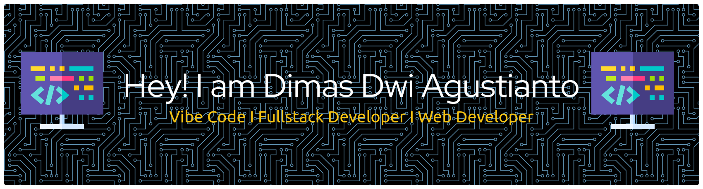

# 👋 Hello, I'm Sakum Tala

### 💻 *Full-Stack Web Developer | Backend Engineer | Mobile Developer | Tech Enthusiast*

Welcome to my GitHub profile! I'm passionate about building intuitive web experiences with Next.js, developing scalable backends with Go, creating mobile apps with Flutter, and exploring systems and hardware. Running on **Ubuntu 24 Pro**.

**Tech Stack:** Next.js • React • Go • Node.js • Flutter • C/C++/C# • Python

---

## 🔭 Current Focus

- 🚀 Building full-stack applications with **Next.js** + **Go** backend
- 📱 Creating cross-platform mobile apps with **Flutter**
- 🛠️ Exploring OS internals, server setup, and hardware tinkering on **Ubuntu 24 Pro**
- 🎥 Creating content to simplify complex tech topics

---

## 🧠 Skills & Technologies

### 🌐 Frontend Development

### ⚙️ Backend Development

### 📱 Mobile Development

### 🔧 Systems & Languages

### 🛠️ Systems, Server & Hardware
- **Operating System:** Ubuntu 24 Pro (Primary Development Environment)
- OS Installation & Configuration (Windows, macOS, Linux Distros)
- VPS Setup & Server Management (SSH, Apache, Nginx, Go servers)
- PC Building & Upgrading (custom builds, performance tuning)
- Android Customization (custom ROMs, flashing, device repair, Flutter development)

---

## 📊 GitHub Stats

  

  

  

---

## 🏆 GitHub Trophies

  

---

## 🤝 Open to Collaborate On

- Full-stack web applications (Next.js + Go)
- Backend services and REST/GraphQL APIs
- Mobile applications (Flutter)
- Open-source projects
- System setup & automation projects
- Educational content and real-world tech solutions

---

## 📫 Let’s Connect!

- 💼 [LinkedIn](https://www.linkedin.com/in/dimas-dwi-agustianto-6b304a348/)
- 🐦 [Twitter / X](https://x.com/SakumT57692)
- 📸 [Instagram](https://www.instagram.com/psakum)
- 📺 [YouTube](https://youtube.com/@SAKUM_DISINI_PA)
- 📧 [sakumtala@sakum.my.id](mailto:sakumtala@sakum.my.id)

---

## ⚡ Fun Facts

- �️ Running **Ubuntu 24 Pro** as my primary development environment
- 🚀 Combine Next.js frontend magic with Go backend power for maximum productivity
- 📱 Building cross-platform mobile apps with Flutter and customizing Android devices
- 🔧 I enjoy tweaking OS internals and experimenting with different setups
- 💡 I love turning ideas into scalable, real-world tech solutions
- 🌐 I believe tech should be accessible, creative, and empowering
- ⌨️ Passionate about systems programming with C/C++ and low-level optimization

---
 
---

⭐ *Made with passion by* [@SakumDisiniPa](https://github.com/SakumDisiniPa)
